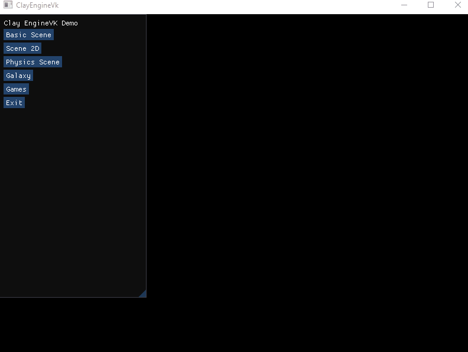

# Clay Engine Demo Desktop

Demo application of the ClayEngineVK static library (https://github.com/VadimEngine/ClayEngineVK) showcasing building a Desktop application. 

# Load all submodules
- `git submodule update --init --recursive`

### Build
- `cmake -S . -B build`
- `cmake --build ./build/`

### Run
- `./build/Debug/ClayEngineVKDemo.exe`

### Compile shader
- `C:/VulkanSDK/1.3.296.0/Bin/glslc.exe -fshader-stage=vert shader.vert -g -o vert.spv`
- `C:/VulkanSDK/1.3.296.0/Bin/glslc.exe -fshader-stage=frag shader.frag -g -o frag.spv`
